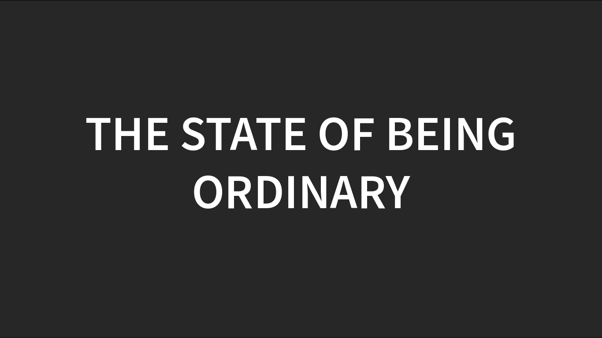

# reveal-init
`reveal-init` is used to create a new Reveal.js presentation project.

## Just `reveal-init` and see what you've got

```shell
reveal-init -t "The State of Being Ordinary" --header _TITLE -f black --plugin zoom-js - ordinary
```



```shell
reveal-init --header "My Point of View" -f sky --plugin notes notes-server - my_view
```


```shell
reveal-init -t "On Serif | John Doe" --header "Serif on the Web" -theme serif -n 12 serif
```


```shell
reveal-init -t "Evolution of Computer Graphics" --header _TITLE -f league --plugin notes notes-server zoom-js - computer_graphics
```


```shell
reveal-init -t "Boring slides | Boring Inc." --header "There's nothing here.<br>Just boring slides." boring
```


## Nice features

1. Custom `<title>`
2. Make a big header for your presentation and put it in the first slide if you
want
3. Import 0, 1, or many themes
4. Import plugins too
5. 2-space tabs and 4-space tabs

## License

Licensed under The Unlicense.

```
This is free and unencumbered software released into the public domain.

Anyone is free to copy, modify, publish, use, compile, sell, or
distribute this software, either in source code form or as a compiled
binary, for any purpose, commercial or non-commercial, and by any
means.
```
